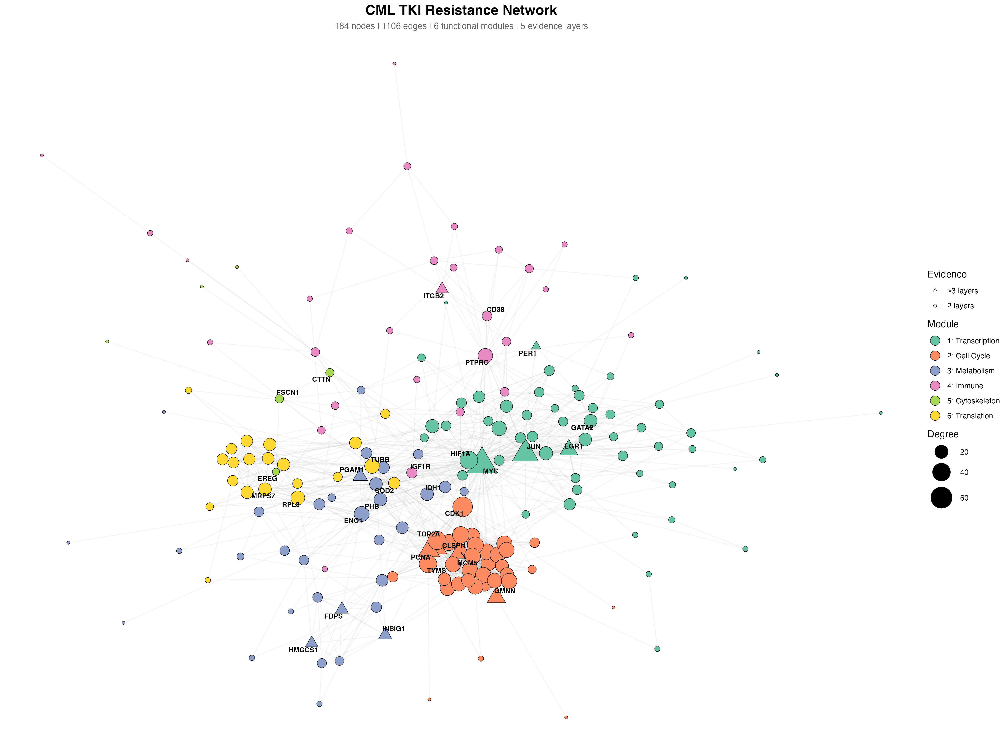
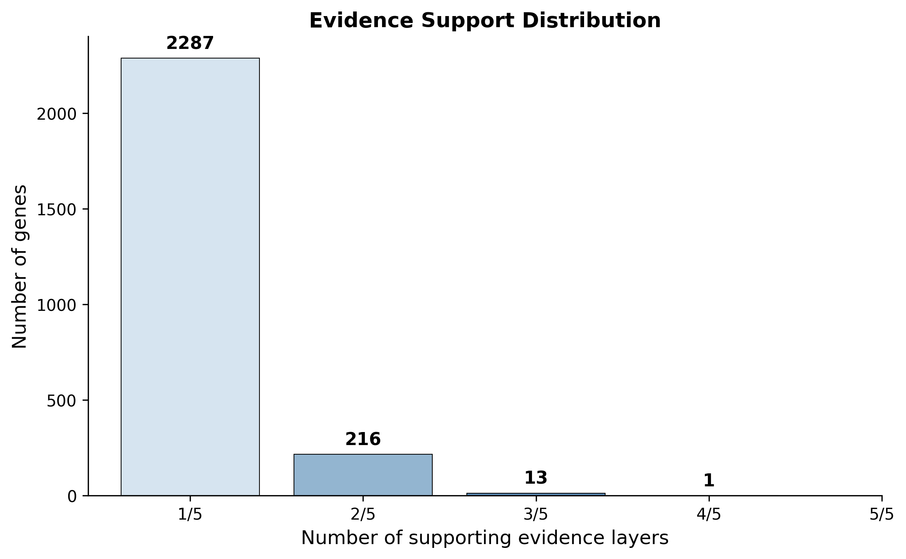
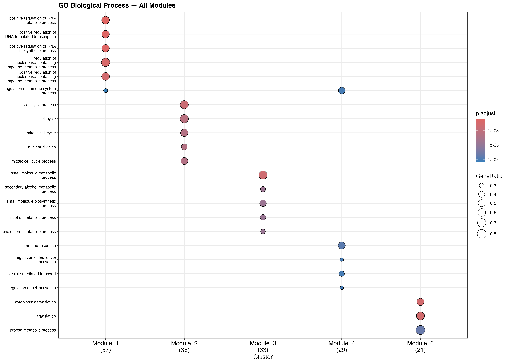
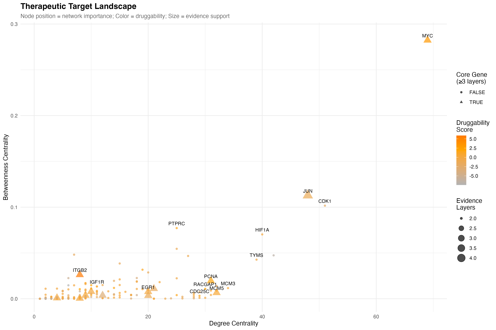
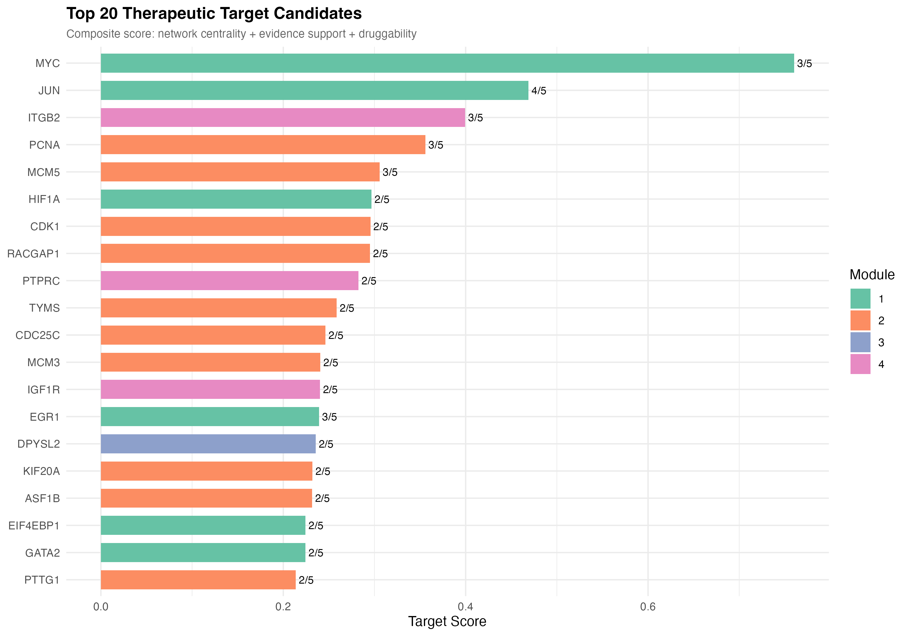
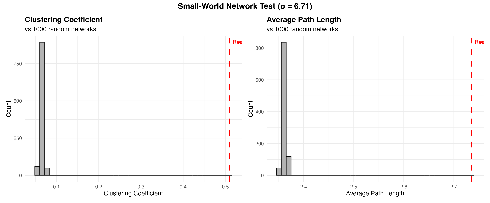

# Multi-Evidence Network Analysis of CML TKI Resistance

A protein–protein interaction network analysis integrating **five independent evidence layers** across three research groups to identify consensus hub genes and druggable targets in chronic myeloid leukaemia (CML) tyrosine kinase inhibitor (TKI) resistance.



## Key Findings

- **2,517 unique genes** extracted across 5 evidence layers; **230 consensus genes** supported by ≥2 independent sources
- **JUN** is the only gene supported by 4/5 evidence layers — patient scRNA-seq, CRISPR KO transcriptomics, patient bulk RNA-seq, and phosphoproteomics
- The resistance network exhibits **small-world properties** (σ = 6.71), with 7.8× higher clustering than random networks but comparable path lengths
- **6 functional modules** map to distinct biological programmes: transcriptional reprogramming (MYC/JUN), cell cycle acceleration (CDK1), metabolic rewiring via the mevalonate/cholesterol pathway (FDPS/HMGCS1), immune evasion (PTPRC/ITGB2), cytoskeletal remodelling, and translational upregulation
- **MYC** emerges as the top therapeutic target by composite score (network centrality + evidence support + druggability), followed by JUN and ITGB2

## Evidence Layers

| Layer | Source | Year | Evidence Type | Genes | Origin |
|:-----:|--------|:----:|---------------|:-----:|--------|
| 1 | [Krishnan et al., *Blood*](https://doi.org/10.1182/blood.2022017295) | 2023 | Patient scRNA-seq (bone marrow) | 540 | Singapore |
| 2 | [Adnan Awad et al., *Cell Reports Medicine*](https://doi.org/10.1016/j.xcrm.2024.101521) | 2024 | CRISPR KO transcriptomics (K562) | 797 | Finland |
| 3 | Krishnan et al., *Blood* | 2023 | ML classifier genes (elastic net) | 42 | Singapore |
| 4 | [Sacco et al., *bioRxiv*](https://doi.org/10.1101/2025.01.08.631869) | 2025 | Patient bulk RNA-seq | 1,016 | Italy |
| 5 | Sacco et al., *bioRxiv* | 2025 | Phosphoproteomics + Proteomics | 367 | Italy |

The integration spans **six experimental platforms** (scRNA-seq, bulk RNA-seq, CRISPR screens, proteomics, phosphoproteomics, machine learning), both **patient samples and cell lines**, and **three independent research groups** from Singapore, Finland, and Italy.



## Modules and Biological Interpretation

Community detection (Louvain algorithm, modularity = 0.52) identified six functional modules:

| Module | Genes | Hub Gene | Function | Core Genes (≥3 layers) |
|:------:|:-----:|----------|----------|------------------------|
| 1 | 57 | MYC | Transcriptional reprogramming | MYC, JUN, EGR1, PER1 |
| 2 | 37 | CDK1 | Cell cycle / DNA replication | MCM5, PCNA, GMNN, CLSPN |
| 3 | 34 | ENO1 | Metabolic rewiring (mevalonate pathway) | PGAM1, INSIG1, FDPS, HMGCS1 |
| 4 | 29 | PTPRC | Immune evasion / microenvironment | ITGB2 |
| 5 | 6 | CTTN | Cytoskeletal signalling | — |
| 6 | 21 | TUBB | Translation machinery | — |



## Therapeutic Target Ranking

Targets are ranked by a composite score combining degree centrality (30%), betweenness centrality (20%), evidence layer count (30%), and druggability score (20%).





**Bridge genes** (PTPRC, RALA, ITGB2) connect the immune module to cell-intrinsic resistance programmes — potential targets for combination therapy strategies.

## Network Properties

| Metric | Value |
|--------|------:|
| Nodes | 184 |
| Edges | 1,106 |
| Communities | 6 |
| Modularity | 0.52 |
| Clustering coefficient | 0.510 |
| Average path length | 2.74 |
| Small-world σ | 6.71 |
| Average degree | 12.0 |



## Repository Structure

```
CML-TKI-Resistance-Network/
├── data/
│   ├── evidence_matrix.csv              # Gene × layer binary matrix
│   ├── consensus_genes_2plus.txt        # 230 genes for network (≥2 layers)
│   ├── consensus_genes_3plus.txt        # 14 core genes (≥3 layers)
│   ├── krishnan_2023_layer1_full.csv    # Layer 1: scRNA-seq DEGs
│   ├── awad_2024_layer2_full.csv        # Layer 2: CRISPR KO DEGs
│   ├── krishnan_2023_layer3_classifier_genes.csv  # Layer 3: ML genes
│   ├── sacco_2025_layer4_patient_degs.csv  # Layer 4: Patient RNA-seq
│   ├── sacco_2025_layer5_full.csv       # Layer 5: Phosphoproteomics
│   └── sacco_2025_druggability.csv      # Druggability scores
├── scripts/
│   ├── 01_data_loading.R                # Load and validate evidence layers
│   ├── 02_string_network.R              # Query STRING-db, build PPI network
│   ├── 03_network_analysis.R            # Centrality, communities, small-world
│   ├── 04_enrichment.R                  # GO and KEGG enrichment per module
│   ├── 05_druggability.R                # Target scoring and ranking
│   └── 06_visualization.R              # Network plots and summary figures
├── results/
│   ├── network_edges.csv                # STRING PPI edge list
│   ├── network_nodes.csv                # Node attributes
│   ├── network_centrality.csv           # Full centrality metrics
│   ├── target_analysis.csv              # Composite target scores
│   ├── module_summary.csv               # Module-level statistics
│   └── go/kegg_enrichment_*.csv         # Enrichment results per module
├── figures/
│   ├── network_main.png                 # Main network visualization
│   ├── upset_plot.png                   # Evidence layer intersections
│   ├── evidence_distribution.png        # Evidence count histogram
│   ├── top_genes_heatmap.png            # Core genes × layers
│   ├── pairwise_overlap_heatmap.png     # Layer overlap matrix
│   ├── hub_genes_barplot.png            # Top 30 hubs by degree
│   ├── target_landscape.png             # Degree vs betweenness scatter
│   ├── top_targets_barplot.png          # Top 20 composite targets
│   ├── small_world_test.png             # Random network comparison
│   ├── go_enrichment_all_modules.png    # Comparative GO dotplot
│   └── go_enrichment_module_*.png       # Per-module GO enrichment
├── CML_TKI_Resistance_Network_Dataset_Registry.xlsx
├── README.md
└── LICENSE
```

## Reproducibility

### Requirements

**R packages:**
```r
# Bioconductor
BiocManager::install(c("STRINGdb", "clusterProfiler", "org.Hs.eg.db", "enrichplot"))

# CRAN
install.packages(c("igraph", "ggraph", "tidygraph", "tidyverse",
                    "ggrepel", "RColorBrewer", "pheatmap", "patchwork"))
```

### Running the Analysis

Scripts are designed to run sequentially. Each script loads the previous workspace and saves its own:

```bash
# From the project root directory in R:
source("scripts/01_data_loading.R")
source("scripts/02_string_network.R")     # Requires internet (STRING API)
source("scripts/03_network_analysis.R")
source("scripts/04_enrichment.R")          # Requires internet (KEGG API)
source("scripts/05_druggability.R")
source("scripts/06_visualization.R")
```

### Data Sources

All data used in this analysis is publicly available:

- **Krishnan et al. 2023** — Supplementary Tables from [Blood](https://doi.org/10.1182/blood.2022017295); Zenodo archive [10.5281/zenodo.5118611](https://doi.org/10.5281/zenodo.5118611); ShinyCell app at [scdbm.ddnetbio.com](http://scdbm.ddnetbio.com/)
- **Adnan Awad et al. 2024** — Supplementary Table S4 from [Cell Reports Medicine](https://doi.org/10.1016/j.xcrm.2024.101521)
- **Sacco et al. 2025** — GitHub: [SaccoPerfettoLab](https://github.com/SaccoPerfettoLab/Chronic_myeloid_leukemia_SignalingProfiler2.0_analysis); GEO: [GSE280476](https://www.ncbi.nlm.nih.gov/geo/query/acc.cgi?acc=GSE280476); PRIDE: [PXD056957](https://www.ebi.ac.uk/pride/archive/projects/PXD056957)
- **PPI data** — [STRING database v12.0](https://string-db.org/) (medium confidence, score ≥ 400)

## Methods Summary

1. **Evidence extraction** — Differentially expressed genes, CRISPR screen hits, ML classifier features, and differentially phosphorylated proteins were extracted from five datasets across three publications
2. **Consensus scoring** — Genes were scored by the number of independent evidence layers supporting them (1–5)
3. **Network construction** — 230 consensus genes (≥2 layers) were queried against STRING v12.0 to obtain protein–protein interactions
4. **Topology analysis** — Degree, betweenness, and eigenvector centrality computed; Louvain community detection; small-world properties tested against 1,000 random networks
5. **Functional enrichment** — GO Biological Process and KEGG pathway enrichment per module using clusterProfiler
6. **Target prioritisation** — Composite score integrating network centrality, evidence support, and druggability from SignalingProfiler 2.0

## License

This project is for academic and educational purposes. All source datasets retain their original licensing terms.

## Author

Cheshta Chhabra

## Acknowledgements

This project was developed as an independent bioinformatics analysis during a research internship at Duke-NUS Medical School, Cancer & Stem Cell Biology Programme. The analysis uses publicly available data from Krishnan et al. (Duke-NUS/SGH), Adnan Awad et al. (University of Helsinki), and Sacco et al. (Sapienza University of Rome).
